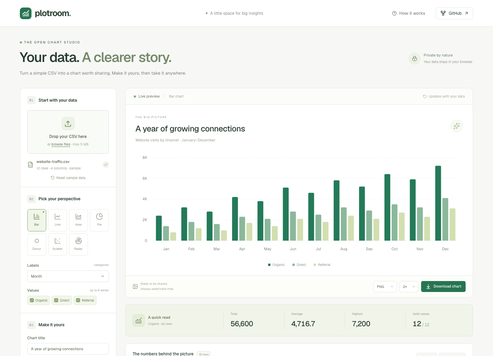

# Plotroom

**Your data. A clearer story.**

An open-source chart studio built with Next.js, shadcn/ui, and Recharts. Upload a CSV, edit the numbers, choose a chart, and download a picture you can use anywhere.

[](https://vercel.com/new/clone?repository-url=https%3A%2F%2Fgithub.com%2Fmariansandurdesign%2Fcsv-to-chart-library)



## Features

- Seven charts: bar, line, area, pie, donut, scatter, and radar.
- CSV/TSV import through a file picker or drag and drop. Detects commas, semicolons, tabs, and pipes; supports quoted fields, embedded newlines, UTF-8 BOMs, and duplicate headers.
- Editable table with pagination, add/delete rows, and undo for the last 20 data changes. Press Enter or leave a cell to apply; Escape cancels the current edit.
- Column mapping, up to six series, four color palettes, chart titles/subtitles, and grid/legend toggles.
- PNG export at 1×, 2×, or 3× resolution; scalable, self-contained SVG export. Includes titles and legends, without watermarks.
- Download the edited data as CSV.
- Total, average, maximum, and valid-value count for the first selected series, calculated over the complete dataset.
- Sample data included. Responsive layout, keyboard controls, and an in-app guide.
- All data processing runs inside the browser tab. No account, API key, database, analytics, or file-upload endpoint.

## Run locally

Use Node.js **22.12 or newer** and npm.

```bash
git clone https://github.com/mariansandurdesign/csv-to-chart-library.git
cd csv-to-chart-library
npm ci
npm run dev
```

Open [localhost:3000](http://localhost:3000).

```bash
npm run build      # Generate a static production site in out/
npm start          # Preview that build on port 3000
npm run lint
npm run typecheck
npm test           # CSV and numeric-processing unit tests
npx playwright install chromium
npm run test:e2e   # Browser tests against the production build
```

## Deploy on Vercel

Use the Deploy button above, or import this GitHub repository at [Vercel New Project](https://vercel.com/new).

1. Choose the **Next.js** framework preset.
2. Keep the build command as `npm run build` and the default output setting. The project uses Next.js static export (`output: "export"`).
3. Use Node.js 22 or newer. No environment variables or external services are needed.
4. Click **Deploy**. Subsequent pushes can deploy automatically through Vercel's Git integration.

[Vercel Hobby](https://vercel.com/docs/plans/hobby) is free for personal, noncommercial projects within the plan's usage limits. Open-source licensing alone does not determine hosting-plan eligibility. This app requires no paid backend services. Its `out/` directory can also be hosted on any static host.

## Data behavior and limits

- The first row contains column headers. Import limits: **5 MB, 10,000 rows, 50 columns**.
- Numeric detection accepts decimals, negatives, scientific notation, and unambiguous comma thousands separators such as `"1,234.56"`. Decimal commas, currency symbols, percentages, and dates are not automatically converted. A column appears as numeric when at least half of its nonempty cells are valid numbers.
- Blank or invalid numeric cells are treated as missing, not zero. They are excluded from summaries and indicated in the preview. Missing points leave gaps in line/area charts.
- Pie/donut use the first selected series; those charts and radar require nonnegative values. Scatter requires numeric X and Y values on the same row. Duplicate category labels remain separate rows; data is not silently aggregated.
- Charts and image exports show the **first 100 rows**, or **first 12 rows for pie, donut, and radar**, to keep images readable. A notice appears whenever this limit applies. Summaries and edited CSV downloads use **all rows**.
- Data is kept in memory for the current tab only. Reloading clears edits. Download the edited CSV before leaving. Undo applies to edits and row operations; uploading a file or resetting the sample begins a new dataset.
- CSV exports escape spreadsheet formula-like strings with a leading apostrophe. Valid signed numbers remain numeric. The original values remain unchanged in the app.
- PNG files have a white background. SVG files contain vector chart elements and use system fonts so they do not need external assets. Very long export titles and legend labels are compressed to fit the image width.

## Project structure

```text
src/app/                     Next.js page, layout, and theme
src/components/chart-workspace.tsx  Workspace state and controls
src/components/chart-preview.tsx    Reusable seven-type chart renderer
src/components/data-table.tsx       Editable paginated table
src/components/ui/                  shadcn/ui components (Base UI)
src/lib/data.ts                     CSV parsing, serialization, and summaries
src/lib/chart-config.ts             Chart definitions and palettes
src/lib/export-chart.ts             Browser-side SVG/PNG generation
src/lib/data.test.ts                Unit tests
tests/workspace.spec.ts             End-to-end browser tests
```

This repository is a runnable application and source library, not a published npm package. Reuse `ChartPreview`, the data utilities, and the export function in your own React projects. `ChartPreview` is a client component; provide `data`, selected `series`, a chart `type`, `colors`, and `showGrid`, inside a container with a defined height.

## Contributing

Issues and pull requests are welcome. See [CONTRIBUTING.md](CONTRIBUTING.md). CI checks lint, types, unit tests, the production build, and browser tests on each push and pull request.

## License

[MIT](LICENSE). You can use and modify the code in personal or commercial projects. The app adds no license restriction or watermark to exported images; rights to the uploaded data remain with its owner.
